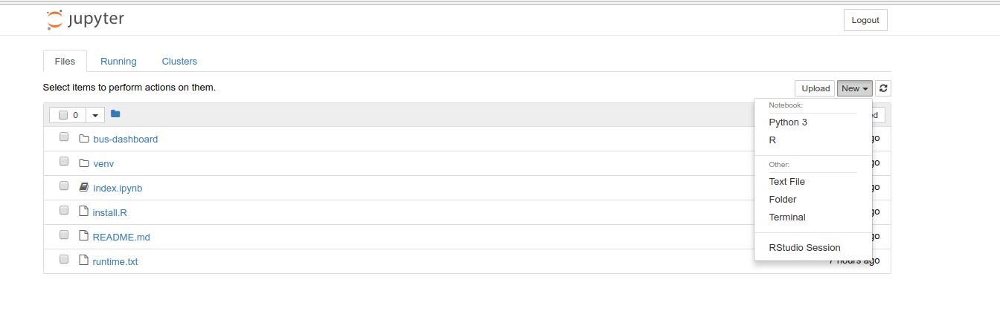

# repo2docker-r with R

environement, runtime.txt file, and shiny app!

This is a continuous build template based on the [R](https://github.com/binder-examples/r) binder example, meaning that it shows how you can install R alongside Python (meaning Jupyter
notebooks!) and then deploy a container automatically using Docker Hub. The container also has RStudio and Shiny. Note that to
start an rstudio session, you should go to new --> Rstudio.



The build->test->deploy setup will have integration for a [containershare](https://vsoch.github.io/containershare) registry. In a nutshell, when you add the [configuration files](.circleci) here to your repository and connect to continuous integration, you will get a container, Github pages to serve metadata with complete manifest and inspection of your containers. It's a completely free, transparent, and open source way to practice reproducible science. 

<a href="https://www.github.com/vsoch/containershare" target="_blank">

</a>

**Important Notes**

 - The [runtime.txt](runtime.txt) file must be formatted as follows: `r-<YYYY>-<MM>-<DD>` where YYYY-MM-DD is a snapshot at MRAN that will be used for installing libraries.
 - The [install.R](install.R) (optional) will be executed during build, and can be used to install libraries.
 - Both [RStudio](https://www.rstudio.com/) and [IRKernel](https://irkernel.github.io/) are installed by default, so you can use either the Jupyter notebook interface or the RStudio interface.
 - This repository also contains an example of a Shiny app.

## Contributors

> <@vsoch:Stanford Research Computing Center>
> <@binder-examples:Binder Examples from the Jupyter team>

# Overview
This template will let you do the following:

 1. Add your R environment files (e.g., [index.ipynb](index.ipynb), [runtime.txt](runtime.txt), [install.R](install.R)) to a Github repository
 2. Connect the respository to CircleCI and Docker Hub to deploy a container along with metadata on Github Pages
 3. Submit the container to a containershare registry, or just share the repository with your collaborators.

This usage is adopted from the [continuous-build](https://www.github.com/binder-examples/continuous-build/)
repository. The software has been extended to deploy metadata and a web interface to explore it back
to the Github repository. As described above, you will be able to push a [Docker](https://docs.docker.com/)
container to [Docker Hub](https://hub.docker.com/) directly from a
Github repository that has a Jupyter notebook. 

## Reproducible Content Generated

 - **container** you generate a Docker Hub container with your notebook and dependencies, ready for use wherever you can run the container. The container always provides a latest, but also a tagged version coinciding with the first 10 characters of each merged commit.
 - **maniests** along with Docker Hub manifests, the Continuous Integration step deploys a table of updated container manifests to the Github repository Github pages, which are available programatically and from an interactive web interface. 
 - **inspection** using the [container-diff](https://github.com/GoogleContainerTools/container-diff) tool, every tag of a container has apt, pip, and files recorded. Yes, this means that you can programatically find containers based on software. @vsoch will be developing a command line tool to help with this.

Importantly, both manifests and the inspections are generated by the continuous integration, and served with the same repository that bullds the container.

## Getting Started

Today you will be doing the following:

  1.  Fork and clone the continuous-build Github repository to obtain
      the hidden `.circleci` folder.
  2.  creating an image repository on Docker Hub
  3.  connecting your repository to CircleCI
  4.  creating a Github Machine User account to deploy back to Github Pages
  5.  push, commit, or create a pull request to trigger a build.

You don't need to install any dependencies on your host to build the
container, it will be done on a continuous integration server, and the
container built and available to you to pull from Docker Hub. If you add a Machine
user (step 4) your container 

### Step 1. Clone the Repository

First, fork the [repo2docker-r](https://www.github.com/vsoch/repo2docker-r/)
Github repository to your account, and clone the branch.

```bash
git clone https://www.github.com/<username>/repo2docker-r
git clone git@github.com:<username>/repo2docker-r.git
```

### Step 2. Configuration

The hidden folder [.circleci/config.yml](.circleci/config.yml) has instructions for
[CircleCI](https://circleci.com/dashboard/) to automatically discover
and build your repo2docker R notebook container. There is also a [template.html](template.html)
file that is used as a template for your Github pages. The first does most of the steps required for
build and deploy, including:

 1.  clone of the repository with the notebook that you specify
 2.  build
 3.  push to Docker Hub
 4.  generate manifests and inspections
 5.  generate Github Pages content, and push back to Github pages

Thus, if you have forked the repository and cloned your fork, you should be able to use
the files that are pulled. And if you are an advanced user, you could even customize if you
please.

### Step 3. Docker Hub

Go to [Docker Hub](https://hub.docker.com/), log in, and click the big
blue button that says "create repository" (not an automated build).
Choose an organization and name that you like (in the traditional format
`<ORG>/<NAME>`), and remember it! We will be adding it, along with your
Docker credentials, to be encrypted.


### Step 4. Github Machine User

If you want to deploy the manifests back to Github pages, the easiest option (and
one that doesn't put your entire Github account under risk) is to create a machine
user. This comes down to creating a second Github user account (with a different email)
and then giving the account permission to the repository, and generate an ssh key for it.
You won't need to worry about how the deploy is done - this is handled in the circleCI
recipe included with the template. Here are instructions for setting up credentials, derived
from [this great resource](https://github.com/DevProgress/onboarding/wiki/Using-Circle-CI-with-Github-Pages-for-Continuous-Delivery).

**Why do I need to do this?**

Pushing content back to Github pages requires a deploy key. Although Circle will generate a deploy key for you, it only has read access. We need to generate a machine user with write access. Read more about machine user keys [keys](https://circleci.com/docs/github-security-ssh-keys/#machine-user-keys)

**Instructions**

 1. Open a second browser so you can stay logged into your main Github account in one browser, and [create a new Github account](https://github.com/join) there. You will basically need another email address, and a creative username.
 2. In your main Github account (the primary browser) add this user as a collaborator to your repository. They will need push access.
 3. Accept the invitation in the second browser, or the emali sent to you.
 4. In the second browser, again log in to [Circle CI](https://circleci.com/) with your new Github account. Make sure you log in via your Github machine user account, and that you have accepted the invitation.
 5.  Click on "Add Projects", and select your regular Github username under "Choose Organization". This is the owner of the project.  Then click "Follow Project" next to the repository name on the left of the menu. 
 6. This is important! Once followed, go to the Project Settings -> "Checkout SSH keys", and click on the button to "Authorize with GitHub." You will be taken back to Github, signed in as the machine user, and you should click "Authorize Application." Finally, click the Create and add machine user github name key button on the same page.

**Generate Key**
Follow the instructions [here](https://help.github.com/articles/generating-a-new-ssh-key-and-adding-it-to-the-ssh-agent/#generating-a-new-ssh-key) to generate a new ssh key. The steps to add it to your project are a little weird, but I'll try to be specific:

 - your machine user must first be added as a collaborator to the project
 - you must then log in to CircleCI with your **machine user** and click on Jobs to see the project
 - when you see it, click on any of the steps and click on "Follow Project" in the upper right
 - Under the project settings (gear icon in the upper right) under "Permissions" click on "Checkout SSH keys" and then click the button to "Add user key." If you don't do this, it will give you an error that the key is read only.

The final step is to edit the [.circleci/config.yml](.circleci/config.yml) file to add your ssh key for circle to find. See the section that looks like this?

```yaml
- add_ssh_keys: 
    fingerprints: 
      - "d4:37:a4:3b:1e:ea:eb:6a:b7:e3:0a:52:e2:8c:ac:d0"
```

Replace this value with the fingerprint from your machine user (note that I'm not sure this is completely necessary, but I've been doing it! If you try this and don't need this step, please open an issue to let me know so I can update these instructions!).


### Step 5. Connect to CircleCI

If you do not already have a Circle CI account, head [here](https://circleci.com/signup/) and create one, and
add your project to your Circle CI account.  Here are [instructions](https://circleci.com/docs/getting-started/) if you've never done this before.

Once you have an account, if you navigate to the main [app page](https://circleci.com/dashboard/)
you should be able to click "Add Projects" and then select your
repository. If you don't see it on the list, then select a different
organization in the top left. Once you find the repository, you can
click the button to "Start Building" adn accept the defaults.

Before you push or trigger a build, let's set up the following
environment variables. Also in the project interface on CirleCi, click
the gears icon next to the project name to get to your project settings.
Under settings, click on the "Environment Variables" tab. In this
section, you want to define the following:

1.  `CONTAINER_NAME` should be the name of the Docker Hub repository you
    just created.
2.  `DOCKER_TAG` is the tag you want to use. If not defined, will use
    first 10 characters of commit.
3.  `DOCKER_USER` and `DOCKER_PASS` should be your credentials (to
    allowing pushing)
4.  `GITHUB_USER` and `GITHUB_EMAIL` should be your machine user Github account
5.  `REPO_NAME` should be the full Github url (or other) of the
    repository with the notebook. This doesn't have to coincide with the
    repository you are using to do the build (e.g., "myrepo" in our
    example).

If you don't define the `CONTAINER_NAME` it will default to be the
repository where it is building from, which you should only do if the
Docker Hub repository is named equivalently. If you don't define either
of the variables from step 3. for the Docker credentials, your image
will build but not be pushed to Docker Hub. Finally, if you don't define
the `REPO_NAME` it will again use the name of the repository defined for
the `CONTAINER_NAME`. As a quick sanity check, here are the variables you
should have defined in your CircleCI settings.


### Step 6. Push and Deploy!

Once the environment variables are set up, you can push or issue a pull
request to see circle build the workflow. Remember that you only need
the `.circleci/config.yml`, `.circleci/template.html` and not any other files in the repository. If
your notebook is hosted in the same repo, you might want to add these,
along with your requirements.txt, etc.

## FAQ

**How do I customize the build or template?**

The circle configuration file is the entire workflow that does build, test, and deploy.
This literally means you can edit this text file and change any or all behavior. This could
be as simple as changing some of the text output, to adding an additional set of testing or
deployment options, or more complex like adding entire new steps in the workflow. The template.html
is the same! You can tweak it, completely change it, or throw it out and push something entirely
different back to Github pages. This deployment is open and completely transparent, as it should be.

**How do I run builds for pull requests?**

By default, new builds on CircleCI will not build for pull requests and
you can change this default in the settings. You can easily add filters
(or other criteria and actions) to be performed during or after the
build by editing the `.circleci/config.yml` file in your repository.

**How do I use my container?**

For a repo2docker container, you should expect a jupyter notebook. Here is
an example of how to pull and run this container:

```bash
docker pull <ORG>/<NAME>:<TAG>
docker run -it --name repo2docker -p 8888:8888 <ORG>/<NAME>:<TAG> jupyter notebook --ip 0.0.0.0
```

For a pre-built working example, try the following:

```bash
docker pull vanessa/repo2docker-r
docker run -it --name repo2docker -p 8888:8888 vanessa/repo2docker-r jupyter notebook --ip 0.0.0.0
```

You can then enter the url and token provided in the browser to access
your notebook. When you are done and need to stop and remove the
container:

```bash
docker stop repo2docker docker rm repo2docker
```

## Support
If you want to get help please [post an issue!](https://www.github.com/vsoch/repo2docker-r/issues)
